# ImgMatching_v01 (DINOv3 Image Matching / Embedding Pipeline, Docker)

Docker Desktop 위에서 **DINOv3 기반 임베딩 생성(배치)**, **Reference(회전/크롭) 생성**, **Reference 임베딩**, **FAISS 검색/매칭**, (선택) **run.py 기반 1:1/All-vs-All 매칭** 실험을 수행하기 위한 프로젝트입니다.

- 배치 임베딩은 `manifest*.json` + `data_key.json`로 실행됩니다.
- Patch 후처리에서 **TopK/PCA 로직은 제거**되어, 현재는 `raw / subsample` 변형만 지원합니다(`project/imatch/postprocess.py`, `project/imatch/variants.py`).
- 본 ZIP에는 `project/visualize.py`가 **포함되어 있지 않습니다**. (추후 추가 예정이라면 `.env`의 `VIS_*`는 그대로 두어도 됩니다)


---


## 시스템 구성도

```mermaid
flowchart TD
  %% =========================
  %% Host ↔ Container Mounts
  %% =========================
  subgraph HOST["Windows Host"]
    ENV[".env (host paths + runtime env)"]
    PH["PROJECT_HOST<br/>(repo: ImgMatching_v01)"]
    CH["CODE_HOST<br/>(dinov3 source)"]
    WH["WEIGHTS_HOST<br/>(*.pth weights)"]
    DH["DATASET_HOST<br/>(datasets root)"]
    RH["REFERENCE_HOST<br/>(generated references root)"]
    EH["EXPORT_HOST<br/>(exports root)"]
  end

  subgraph CTR["Docker Container: app (GPU)"]
    P["/workspace/project"]
    C["/workspace/dinov3"]
    W["/workspace/weights (ro)"]
    D["/opt/datasets (ro)"]
    R["/opt/references"]
    E["/exports"]
  end

  PH -- "volume mount" --> P
  CH -- "volume mount" --> C
  WH -- "volume mount" --> W
  DH -- "volume mount" --> D
  RH -- "volume mount" --> R
  EH -- "volume mount" --> E
  ENV -. "docker-compose env" .-> CTR


  %% =========================
  %% Config (JSON manifests)
  %% =========================
  subgraph CFG["Config (in /workspace/project)"]
    DK["project/json/data_key.json<br/>(datasets + weights registry)"]
    M0["project/json/manifest.json<br/>(dataset embedding)"]
    MQ["project/json/manifestQuery.json<br/>(query embedding)"]
    MR["project/json/manifestReference.json<br/>(reference embedding)"]
  end
  P --> CFG


  %% =========================
  %% Pipelines
  %% =========================
  subgraph PIPE["Pipelines"]
    %% (A) Dataset embeddings
    RM["run_manifest.py"]
    TE["Test_Embedding.py"]
    GDF["Generate_DenseFT.py (optional)"]
    EMB["EMBED_ROOT<br/>(/exports/dinov3_embeds or /exports/dinov3_query_embeds)<br/>Global/Patch/Grid + meta"]

    %% (B) Reference generation + reference embeddings
    GQ["Generate_Query.py"]
    QC["imatch/querycreating.py"]
    RSRC["REFERENCE_ROOT<br/>(/opt/references/references_<dataset_key>/R<folder>)"]
    RMQ["run_manifestQuery.py"]
    TEQ["Test_Embedding4Query.py"]
    GDFQ["Generate_DenseFT4Query.py (optional)"]
    REMB["REFERENCE_EMBED_ROOT<br/>(/exports/dinov3_reference_embeds)<br/>Global/Patch/Grid + meta"]

    %% (C) Retrieval / Matching outputs
    FAISS["match_faiss_gpu.py<br/>(FAISS index + TopK retrieval)"]
    REDIS["faiss_4Redis.py (optional)<br/>push results/keys to Redis"]
    OUT["/exports outputs<br/>JSON/PNG/NPY"]
  end

  %% Dataset embedding wiring
  M0 --> RM
  DK --> RM
  RM --> TE
  TE --> EMB
  RM -->|run.generate_denseft| GDF
  GDF --> EMB

  %% Query embedding wiring (same runner as dataset)
  MQ --> RM
  DK --> RM

  %% Reference generation wiring
  GQ --> QC
  QC --> RSRC
  RSRC --> RMQ

  %% Reference embedding wiring
  MR --> RMQ
  DK --> RMQ
  RMQ --> TEQ
  TEQ --> REMB
  RMQ -->|run.generate_denseft| GDFQ
  GDFQ --> REMB

  %% Retrieval wiring
  EMB --> FAISS
  REMB --> FAISS
  FAISS --> OUT
  FAISS --> REDIS

  %% Exports location
  EMB --> OUT
  REMB --> OUT
  E --> OUT


  %% =========================
  %% Shared Core Library
  %% =========================
  subgraph LIB["IMATCH Core (project/imatch)"]
    L0["loading.py<br/>(dataset registry, roots, parsing)"]
    L1["pretrained.py<br/>(model load/forward)"]
    L2["preprocess.py<br/>(resize/normalize)"]
    L3["extracting.py<br/>(tokens/embeddings)"]
    L4["postprocess.py<br/>(raw/subsample)"]
    L5["variants.py<br/>(RuntimeVariant builder)"]
    L6["matching.py<br/>(pairwise matching helpers)"]
    L7["schema.py / utils.py"]
  end

  TE --> L0
  TE --> L1
  TE --> L2
  TE --> L3
  TE --> L4
  TE --> L5
  TE --> L7

  TEQ --> L0
  TEQ --> L1
  TEQ --> L2
  TEQ --> L3
  TEQ --> L4
  TEQ --> L5
  TEQ --> L7

  QC --> L7
```



---

## 0) 요구 사항

Windows 11 + Docker Desktop

Docker Desktop Settings → Resources → File Sharing에서 아래 호스트 폴더들이 공유되어 있어야 합니다.

NVIDIA GPU + 드라이버

확인 명령(호스트 / 컨테이너)
```powershell
docker --version
```
```powershell
docker compose exec app nvidia-smi
```

### 0-1) 로컬 디렉터리 준비(권장)

아래 6개 폴더를 분리해두면 관리가 편합니다.

* Repo: ImgMatching_v01 (Dockerfile, docker-compose.yml, requirements.txt 포함)
* Project mount: ImgMatching_v01/project (컨테이너에 마운트되는 폴더)
* dinov3 source: dinov3_src
* weights: dinov3_weights
* datasets root: Datasets
* references root: Reference
* exports root: dinov3_exports

예시(각자 환경에 맞게):
```
D:\Work\ImgMatching_v01\
D:\Work\dinov3_src\
D:\Work\dinov3_weights\
D:\Data\Datasets\
D:\Data\Reference\
D:\Data\dinov3_exports\
```

### 0-2) 환경 변수(.env) 작성

.env.example을 복사해서 .env 생성

* PowerShell:
```powershell
Copy-Item .env.example .env
```

* Git Bash:
```powershell
cp .env.example .env
```

.env에서 호스트 경로 6개만 우선 맞춥니다.

|변수	| 설명 |	예시(Windows)|
| --- | --- | --- |
| `PROJECT_HOST` | 컨테이너에 마운트할 project 폴더 |`D:\Work\ImgMatching_v01\project` |
| `CODE_HOST` | facebookresearch/dinov3 clone 경로 |	`D:\Work\dinov3_src` |
| `WEIGHTS_HOST` | `.pth` 가중치 루트	| D:\Work\dinov3_weights |
| `DATASET_HOST` | 원본 이미지 데이터셋 루트(상위) |	`D:\Data\Datasets` |
| `REFERENCE_HOST` |	reference 이미지 루트(상위) |	`D:\Data\Reference` |
| `EXPORT_HOST`	| 결과 저장 루트 | `D:\Data\dinov3_exports` |

DATASET_HOST는 project/json/data_key.json의 datasets[*].root들이 상대경로로 들어갈 수 있는 상위 폴더로 잡는 것을 권장합니다.
(예: data_key.json에 root: "01_02_jamshill_data_image"가 있으면, DATASET_HOST는 그 상위 폴더여야 함)

### 0-3) Docker 빌드 & 실행

프로젝트 루트(= Dockerfile, docker-compose.yml 있는 위치)에서:
```powershell
docker compose build
docker compose up -d
docker compose ps
```

컨테이너 쉘 진입:
```powershell
docker compose exec app bash
```

GPU 인식 확인:
```powershell
docker compose exec app nvidia-smi
```
---

## 1) 저장소 구조

ZIP 기준(실제 포함 파일 기준) 최소 구조:
```
ImgMatching_v01/
├─ Dockerfile
├─ docker-compose.yml
├─ requirements.txt
├─ .env
├─ .env.example
├─ handoff.md
└─ project/                      # ← 이 폴더를 PROJECT_HOST로 마운트
   ├─ imatch/
   ├─ json/
   │  ├─ data_key.json
   │  ├─ manifest.json
   │  ├─ manifestQuery.json
   │  └─ manifestReference.json
   ├─ run.py                      # (선택) classic matching entry
   ├─ run_manifest.py             # dataset/query embedding
   ├─ run_manifestQuery.py        # reference embedding
   ├─ Test_Embedding.py
   ├─ Test_Embedding4Query.py
   ├─ Generate_Query.py
   ├─ match_faiss_gpu.py
   └─ ... (기타 스크립트)
```

### 1-1) DINOv3 원본 저장소 준비
```powershell
git clone https://github.com/facebookresearch/dinov3.git D:\Work\dinov3_src
```

### 1-2) 가중치(.pth) 준비

project/json/data_key.json의 weights.dinov3_weights 키 구조와 맞게 폴더를 만들고 .pth를 넣습니다.

예시(폴더 생성):
```powershell
New-Item -ItemType Directory -Path D:\Work\dinov3_weights\01_ViT_LVD-1689M -ErrorAction SilentlyContinue
New-Item -ItemType Directory -Path D:\Work\dinov3_weights\02_ConvNeXT_LVD-1689M -ErrorAction SilentlyContinue
New-Item -ItemType Directory -Path D:\Work\dinov3_weights\03_ViT_SAT-493M -ErrorAction SilentlyContinue
```

### 1-3) 데이터셋(data_key.json) 규칙

project/json/data_key.json이 **“어디에 어떤 파일이 있는지”**를 정의합니다.

핵심 필드:

* datasets.<dataset_key>.root: /opt/datasets 아래에서의 상대 경로(=DATASET_HOST의 하위)
* folder_template: 캡처 폴더명 규칙
* filename_template: 이미지 파일명 규칙
* images: 실제 캡처 목록(필요 시 folder override 가능)

예)
```json
{
  "datasets": {
    "jamshill_image": {
      "root": "01_02_jamshill_data_image",
      "folder_template": "{capture_id}",
      "filename_template": "{capture_id}_{frame:04d}.jpg",
      "images": {
        "250918092555_300": 300
      }
    }
  }
}
```

### 1-4) Reference(회전/크롭) 데이터셋 규칙

Reference는 기본적으로 다음 구조를 기대합니다:

```
<REFERENCE_HOST>/
└─ references_<dataset_key>/
   └─ R<folder>/
      └─ <scene>_<altitude>_<index>_rot###_crop##.jpg
```

그리고 run_manifestQuery.py는 각 index/rotation에 대해 다음 패턴으로 파일을 찾습니다:
* {capture_id}_{label_token}_{index:04d}_rot{rotation:03d}_*.(jpg/png/...)

따라서 Reference 파일명이 scene_altitude_index_rot... 형태라면:
* capture_id는 scene
* label_token은 altitude

가 되도록 data_key.json과 폴더 구성이 맞아야 합니다.
(폴더명(folder)은 저장 방식에 맞게 자유롭게 쓰되, manifestReference.json의 image_groups.folder와 data_key.json의 folder map이 일치해야 합니다.)

---

## 2) 실행 방법(컨테이너 내부 기준)

아래 커맨드는 컨테이너 쉘 내부(/workspace/project)에서 실행한다고 가정합니다.

### 2-1) Dataset 임베딩 (manifest.json)
```powershell
python run_manifest.py --manifest json/manifest.json
```

### 2-2) Query 임베딩 (manifestQuery.json)

run_manifest.py는 출력 루트를 주로 **환경변수 EMBED_ROOT**로 사용합니다.
Query 임베딩을 /exports/dinov3_query_embeds로 분리하고 싶다면 아래처럼 실행 시점에 override 하거나, .env에서 EMBED_ROOT를 바꾼 뒤 컨테이너를 재생성하세요.

(권장: 실행 시 override)
```powershell
EMBED_ROOT=/exports/dinov3_query_embeds python run_manifest.py --manifest json/manifestQuery.json
```

### 2-3) Reference 이미지 생성 (Generate_Query.py)

Generate_Query.py는 현재 스크립트 내부의 FOLDERS, ANGLES, CROP_RATIO를 직접 수정해서 사용합니다.

```powershell
python Generate_Query.py
```

### 2-4) Reference 임베딩 (manifestReference.json)
```powershell
python run_manifestQuery.py --manifest json/manifestReference.json
```

### 2-5) FAISS 검색/매칭

match_faiss_gpu.py는 기본적으로 다음 env를 참조합니다(필요 시 수정):

* RAW_EMBED_ROOT (기본: /exports/dinov3_embeds/shinsung_data)
* RAW_REFERENCE_ROOT (기본: /exports/dinov3_reference_embeds/shinsung_data)
* FAISS_OUT_ROOT

예시:
```powershell
RAW_EMBED_ROOT=/exports/dinov3_query_embeds/jamshill_image \
RAW_REFERENCE_ROOT=/exports/dinov3_reference_embeds/jamshill_reference \
FAISS_OUT_ROOT=/exports/faiss_out \
python match_faiss_gpu.py
```