# Image Matching (Docker)

Docker Desktop 위에서 DINOv3 기반 이미지 매칭과 시각화를 수행하기 위한 프로젝트.  
컨테이너 안에서는 1:1 매칭을 수행하도록 구성되어 있으며, 결과(JSON/PNG)는 호스트의 지정된 디렉터리에 저장.


## 시스템 구성도

```mermaid
flowchart TD
  %% =========================
  %% Host ↔ Container Mounts
  %% =========================
  subgraph HOST["Windows Host"]
    ENV[".env (host paths + runtime env)"]
    PH["PROJECT_HOST<br/>(repo: ImgMatching_v01)"]
    CH["CODE_HOST<br/>(dinov3 source)"]
    WH["WEIGHTS_HOST<br/>(*.pth weights)"]
    DH["DATASET_HOST<br/>(datasets root)"]
    RH["REFERENCE_HOST<br/>(generated references root)"]
    EH["EXPORT_HOST<br/>(exports root)"]
  end

  subgraph CTR["Docker Container: app (GPU)"]
    P["/workspace/project"]
    C["/workspace/dinov3"]
    W["/workspace/weights (ro)"]
    D["/opt/datasets (ro)"]
    R["/opt/references"]
    E["/exports"]
  end

  PH -- "volume mount" --> P
  CH -- "volume mount" --> C
  WH -- "volume mount" --> W
  DH -- "volume mount" --> D
  RH -- "volume mount" --> R
  EH -- "volume mount" --> E
  ENV -. "docker-compose env" .-> CTR


  %% =========================
  %% Config (JSON manifests)
  %% =========================
  subgraph CFG["Config (in /workspace/project)"]
    DK["project/json/data_key.json<br/>(datasets + weights registry)"]
    M0["project/json/manifest.json<br/>(dataset embedding)"]
    MQ["project/json/manifestQuery.json<br/>(query embedding)"]
    MR["project/json/manifestReference.json<br/>(reference embedding)"]
  end
  P --> CFG


  %% =========================
  %% Pipelines
  %% =========================
  subgraph PIPE["Pipelines"]
    %% (A) Dataset embeddings
    RM["run_manifest.py"]
    TE["Test_Embedding.py"]
    GDF["Generate_DenseFT.py (optional)"]
    EMB["EMBED_ROOT<br/>(/exports/dinov3_embeds or /exports/dinov3_query_embeds)<br/>Global/Patch/Grid + meta"]

    %% (B) Reference generation + reference embeddings
    GQ["Generate_Query.py"]
    QC["imatch/querycreating.py"]
    RSRC["REFERENCE_ROOT<br/>(/opt/references/references_<dataset_key>/R<folder>)"]
    RMQ["run_manifestQuery.py"]
    TEQ["Test_Embedding4Query.py"]
    GDFQ["Generate_DenseFT4Query.py (optional)"]
    REMB["REFERENCE_EMBED_ROOT<br/>(/exports/dinov3_reference_embeds)<br/>Global/Patch/Grid + meta"]

    %% (C) Retrieval / Matching outputs
    FAISS["match_faiss_gpu.py<br/>(FAISS index + TopK retrieval)"]
    REDIS["faiss_4Redis.py (optional)<br/>push results/keys to Redis"]
    OUT["/exports outputs<br/>JSON/PNG/NPY"]
  end

  %% Dataset embedding wiring
  M0 --> RM
  DK --> RM
  RM --> TE
  TE --> EMB
  RM -->|run.generate_denseft| GDF
  GDF --> EMB

  %% Query embedding wiring (same runner as dataset)
  MQ --> RM
  DK --> RM

  %% Reference generation wiring
  GQ --> QC
  QC --> RSRC
  RSRC --> RMQ

  %% Reference embedding wiring
  MR --> RMQ
  DK --> RMQ
  RMQ --> TEQ
  TEQ --> REMB
  RMQ -->|run.generate_denseft| GDFQ
  GDFQ --> REMB

  %% Retrieval wiring
  EMB --> FAISS
  REMB --> FAISS
  FAISS --> OUT
  FAISS --> REDIS

  %% Exports location
  EMB --> OUT
  REMB --> OUT
  E --> OUT


  %% =========================
  %% Shared Core Library
  %% =========================
  subgraph LIB["IMATCH Core (project/imatch)"]
    L0["loading.py<br/>(dataset registry, roots, parsing)"]
    L1["pretrained.py<br/>(model load/forward)"]
    L2["preprocess.py<br/>(resize/normalize)"]
    L3["extracting.py<br/>(tokens/embeddings)"]
    L4["postprocess.py<br/>(raw/subsample)"]
    L5["variants.py<br/>(RuntimeVariant builder)"]
    L6["matching.py<br/>(pairwise matching helpers)"]
    L7["schema.py / utils.py"]
  end

  TE --> L0
  TE --> L1
  TE --> L2
  TE --> L3
  TE --> L4
  TE --> L5
  TE --> L7

  TEQ --> L0
  TEQ --> L1
  TEQ --> L2
  TEQ --> L3
  TEQ --> L4
  TEQ --> L5
  TEQ --> L7

  QC --> L7
```



---

## 0) 요구 사항

- **Windows 11** + **Docker Desktop (v.4.46.0 이상)**  
  - Docker Desktop 환경에서 동작.  
  - Docker Desktop Settings → Resources → File Sharing 에서 프로젝트/데이터 폴더가 공유되어 있는지 확인.
- **NVIDIA GPU & 최신 드라이버** (CUDA 12.x 호환)
- **NVIDIA Container Toolkit** (Docker Desktop 설치 시 자동 포함)
- 권장 체크 명령
  ```powershell
  docker --version
  nvidia-smi
  ```
